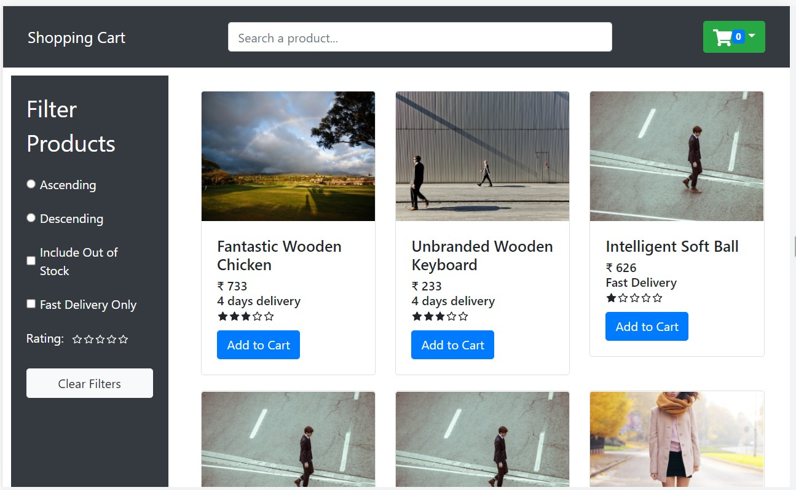
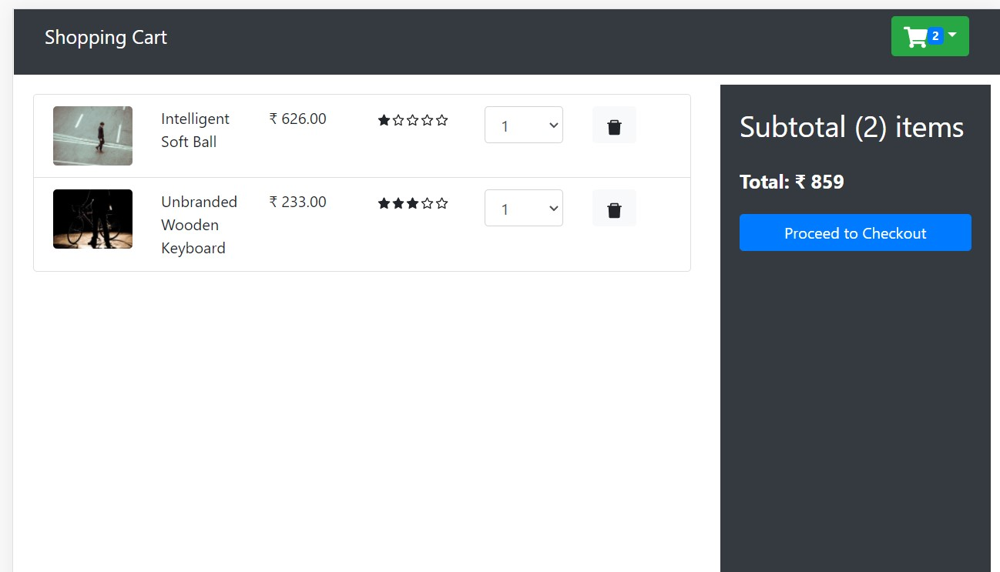

## Project Description
A Shopping Cart Project in React JS. Context API with useReducer Hook for State Management. Hooks like createContext and useContext. Add to cart functionality along with sorting and filtering products by search also.

## Available Scripts

In the project directory, you can run:

### `npm start`

Runs the app in the development mode.\
Open [http://localhost:3000](http://localhost:3000) to view it in your browser.

The page will reload when you make changes.\
You may also see any lint errors in the console.